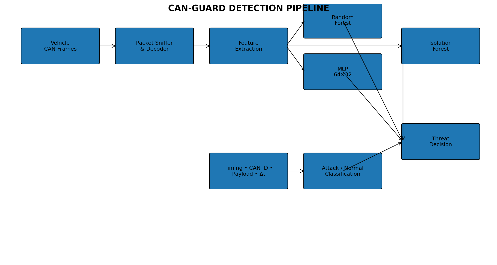
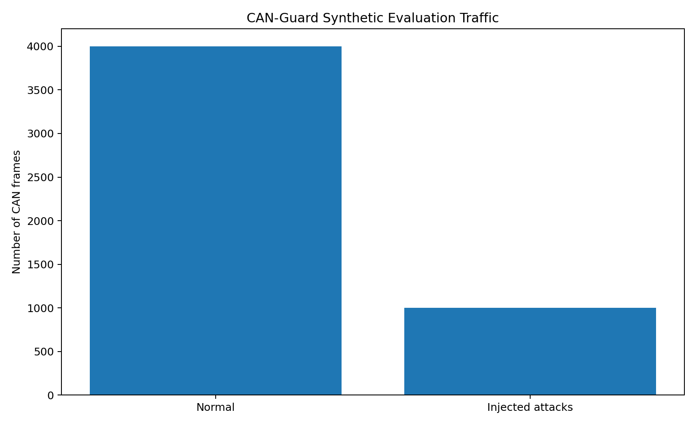
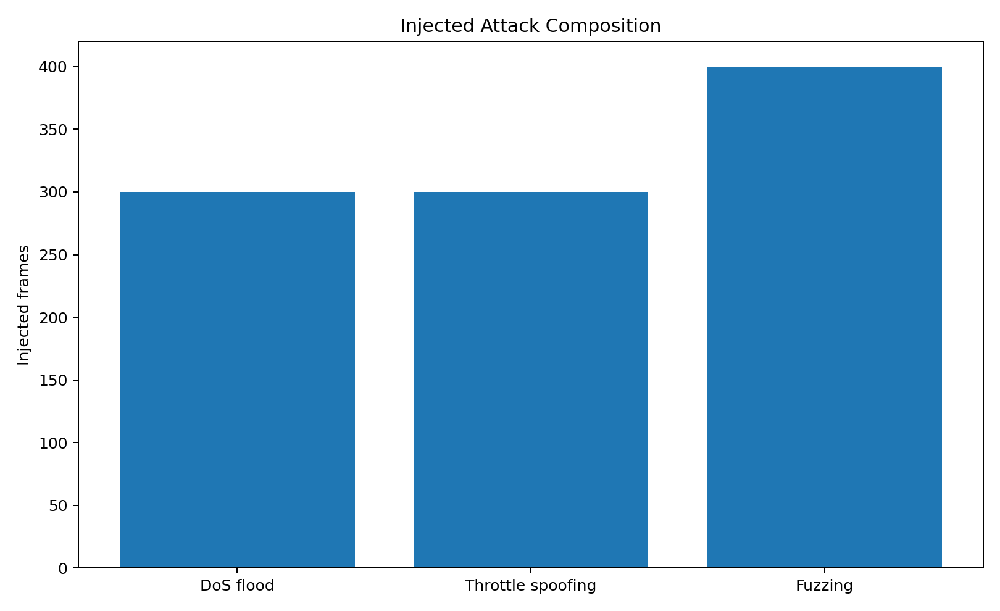
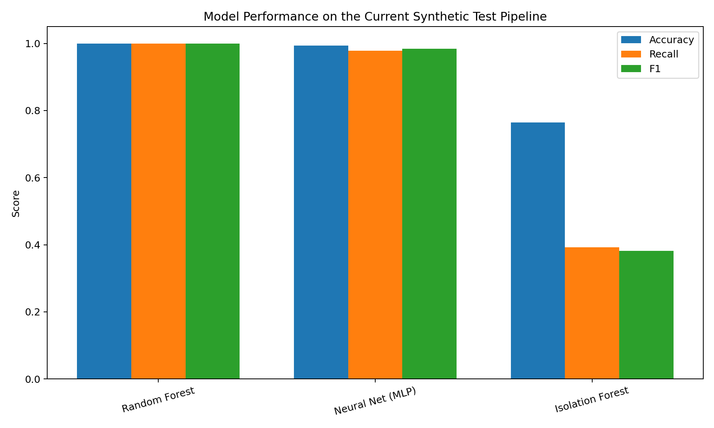
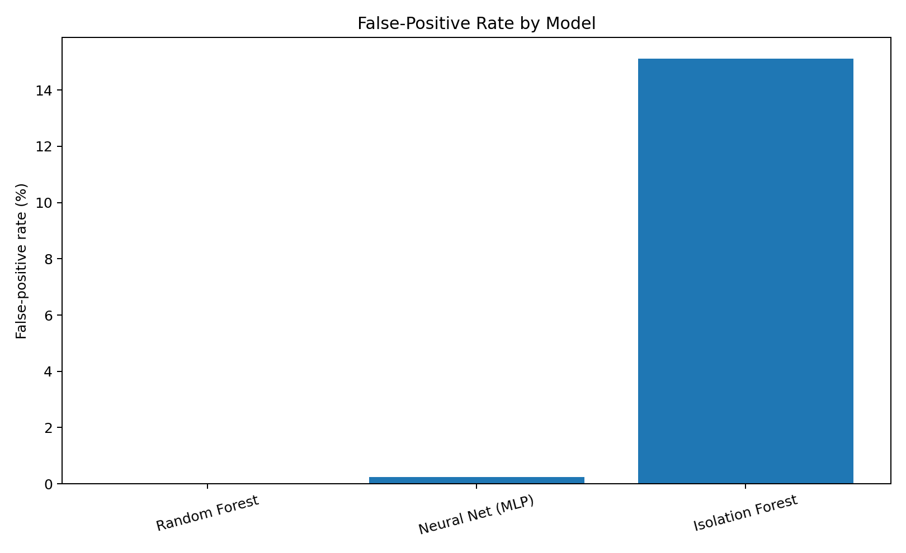
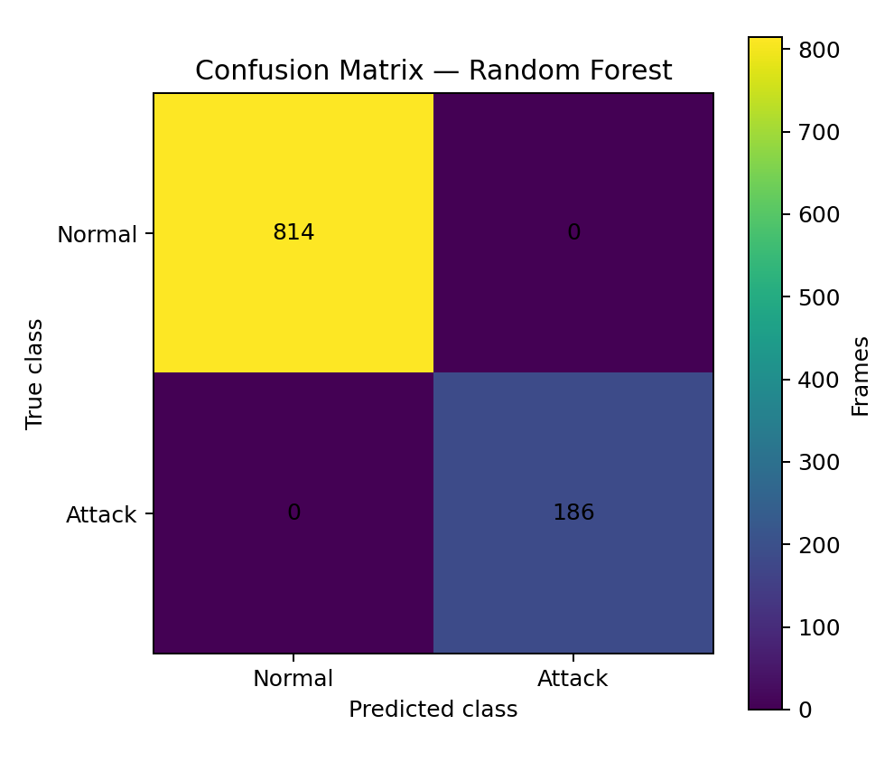
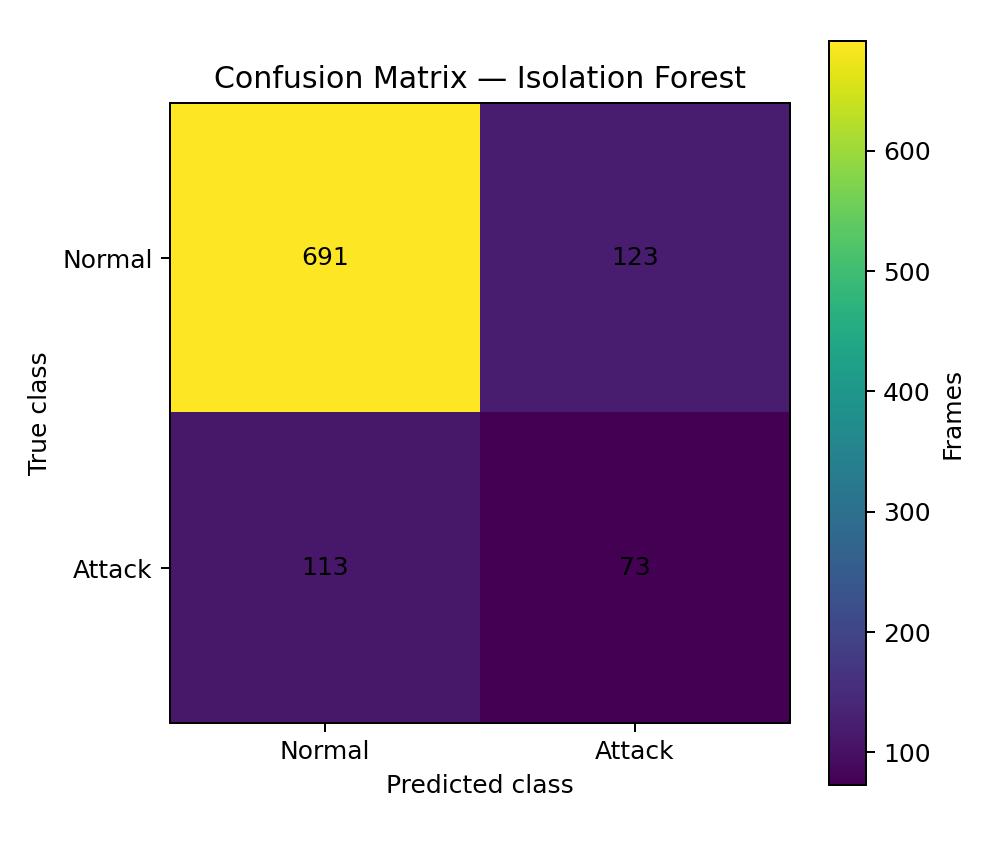

# CAN-Guard: ML Intrusion Detection for Automotive Networks 🚗⚡

<p align="center">
  <strong>Machine-Learning Intrusion Detection for Synthetic Automotive CAN Traffic</strong><br>
  Timing analysis • CAN-ID analysis • Payload analysis • Supervised ML • Unsupervised anomaly detection
</p>

<p align="center">
  
</p>

<p align="center">
  
  
  
  
</p>

> **Project type:** Automotive cybersecurity / CAN-bus intrusion detection / machine learning  
> **Execution model:** Offline synthetic-data research and engineering prototype  
> **Primary goal:** Demonstrate how CAN-frame timing, identifier, payload, and statistical characteristics can be transformed into machine-learning features for attack detection.

---

# 📌 Table of Contents

- [1. Project Overview](#1-project-overview)
- [2. Why CAN Security Matters](#2-why-can-security-matters)
- [3. The Problem](#3-the-problem)
- [4. Project Objectives](#4-project-objectives)
- [5. What CAN-Guard Does](#5-what-can-guard-does)
- [6. Detection Pipeline](#6-detection-pipeline)
- [7. Automotive CAN Background](#7-automotive-can-background)
- [8. Threat Model](#8-threat-model)
- [9. Attack Scenarios](#9-attack-scenarios)
- [10. Synthetic CAN Dataset](#10-synthetic-can-dataset)
- [11. Dataset Generation](#11-dataset-generation)
- [12. Feature Engineering](#12-feature-engineering)
- [13. Timing Features](#13-timing-features)
- [14. CAN Identifier Analysis](#14-can-identifier-analysis)
- [15. Payload Analysis](#15-payload-analysis)
- [16. Temporal Windows](#16-temporal-windows)
- [17. Machine-Learning Architecture](#17-machine-learning-architecture)
- [18. Random Forest](#18-random-forest)
- [19. MLP Neural Network](#19-mlp-neural-network)
- [20. Isolation Forest](#20-isolation-forest)
- [21. Why Multiple Models](#21-why-multiple-models)
- [22. Classification Workflow](#22-classification-workflow)
- [23. Evaluation Methodology](#23-evaluation-methodology)
- [24. Output: Dataset Composition](#24-output-dataset-composition)
- [25. Output: Attack Distribution](#25-output-attack-distribution)
- [26. Output: Model Performance](#26-output-model-performance)
- [27. Output: False-Positive Rate](#27-output-false-positive-rate)
- [28. Output: Confusion Matrices](#28-output-confusion-matrices)
- [29. Interpreting the Results](#29-interpreting-the-results)
- [30. Reproducibility](#30-reproducibility)
- [31. Installation](#31-installation)
- [32. Running the Project](#32-running-the-project)
- [33. Expected Terminal Workflow](#33-expected-terminal-workflow)
- [34. Project Structure](#34-project-structure)
- [35. Configuration and Extension Points](#35-configuration-and-extension-points)
- [36. Engineering Design Decisions](#36-engineering-design-decisions)
- [37. Security Design Principles](#37-security-design-principles)
- [38. Explainability](#38-explainability)
- [39. Limitations](#39-limitations)
- [40. Current Implementation vs Future Architecture](#40-current-implementation-vs-future-architecture)
- [41. Roadmap](#41-roadmap)
- [42. Research and Learning Value](#42-research-and-learning-value)
- [43. Responsible Use](#43-responsible-use)
- [44. Future Research Directions](#44-future-research-directions)
- [45. Conclusion](#45-conclusion)
- [46. License](#46-license)

---

# 1. Project Overview

**CAN-Guard** is an automotive cybersecurity research project that explores machine-learning-based intrusion detection for Controller Area Network (CAN) traffic.

The central idea is simple:

> **A compromised or malicious CAN frame can look syntactically valid while being statistically or behaviorally abnormal.**

CAN is intentionally lightweight. ECUs exchange compact frames containing an identifier and a small payload. The protocol does not, by itself, provide the kind of end-to-end authentication and confidentiality mechanisms normally expected from modern IP security architectures.

That creates an interesting security problem.

An attacker does not necessarily need to break the CAN protocol itself. If an attacker can gain access to a vehicle network, they may be able to inject frames that appear structurally legitimate.

CAN-Guard approaches this problem from the **detection** side.

Instead of attempting to prevent every possible compromise, the system observes CAN traffic and asks:

- Is the frame arriving at an abnormal rate?
- Is the CAN identifier unusual?
- Does the payload look statistically different?
- Does the frame resemble previously observed malicious traffic?
- Does the traffic belong to a known attack class?
- Does it look sufficiently unusual to justify an anomaly alert?

The repository demonstrates these concepts with a reproducible synthetic CAN-data pipeline and three machine-learning approaches:

1. **Random Forest** — supervised classification.
2. **MLP neural network** — nonlinear supervised classification.
3. **Isolation Forest** — unsupervised anomaly detection.

---

# 2. Why CAN Security Matters

## 2.1 CAN was designed for reliability and real-time communication

Controller Area Network was created for distributed electronic control systems where multiple electronic control units need to communicate efficiently.

In a vehicle, many functions can be distributed across ECUs, such as:

- engine-related control,
- braking,
- body electronics,
- steering,
- instrumentation,
- power management,
- diagnostics,
- comfort systems.

The architecture is attractive because ECUs do not need individual point-to-point communication links for every relationship. Instead, nodes share a common communication medium.

That same shared architecture creates a security challenge.

---

## 2.2 The security boundary is different from a traditional network

A normal enterprise network may use:

- TLS,
- authenticated services,
- firewalls,
- IP addresses,
- user identities,
- certificates,
- network segmentation.

A classical CAN bus is much more compact.

A CAN frame generally communicates information through fields such as:

- arbitration identifier,
- control information,
- payload,
- error checking,
- protocol-level framing.

The identifier is not automatically a cryptographic identity.

Therefore, a monitoring system cannot simply ask:

> "Is this frame encrypted?"

Instead, an IDS must often reason from **behavior**.

---

## 2.3 Why behavioral detection is useful

Suppose an ECU normally transmits a particular identifier at a stable rate.

An attacker injects the same identifier.

The injected frame may have:

- a valid CAN identifier,
- a valid payload length,
- valid CAN framing,
- valid electrical signaling.

Yet its **timing** may be abnormal.

Similarly, an attacker may generate an unusual identifier.

Or they may inject payload values that are inconsistent with normal telemetry.

This is where machine learning and statistical detection become useful.

---

# 3. The Problem

The project focuses on a simplified but important security question:

> **Can malicious CAN traffic be distinguished from normal synthetic vehicle traffic using timing, identifier, payload, and machine-learning features?**

The current implementation creates synthetic traffic and deliberately injects three attack patterns:

| Attack | Synthetic behavior | Detection intuition |
|---|---|---|
| DoS flood | Identifier `0x000` injected into traffic | Abnormal identifier / traffic behavior |
| Throttle spoofing | `0x100` frames with maximum payload byte values | Payload and class-pattern anomaly |
| Fuzzing | Random identifiers in `0x400–0x7FF` | Unusual identifier distribution |

The project is therefore both:

- a cybersecurity experiment, and
- a machine-learning classification experiment.

---

# 4. Project Objectives

CAN-Guard is designed around several objectives.

## Objective 1 — Generate realistic-looking synthetic CAN traffic

The system creates a deterministic synthetic stream rather than depending on physical vehicle hardware.

This makes the project:

- portable,
- reproducible,
- safe for experimentation,
- easy to run on a normal computer.

## Objective 2 — Inject recognizable attack patterns

The dataset intentionally contains malicious examples.

This gives supervised models a target class to learn.

## Objective 3 — Convert raw frames into ML features

Raw bytes are not directly meaningful to every classifier.

CAN-Guard therefore constructs a tabular representation containing:

- eight payload-byte features,
- CAN identifier,
- inter-frame timing information.

## Objective 4 — Compare different detection strategies

The project deliberately uses both:

- supervised learning, and
- unsupervised anomaly detection.

This allows a comparison between:

> **"I know what an attack looks like."**

and:

> **"I do not know the exact attack, but this behavior looks unusual."**

## Objective 5 — Produce measurable results

The project reports:

- accuracy,
- recall,
- F1 score,
- false-positive rate,
- confusion matrices.

This makes the system easier to evaluate than a simple "attack detected / attack not detected" demonstration.

---

# 5. What CAN-Guard Does

At a high level:

```text
Synthetic CAN Traffic
        │
        ▼
CAN Frame Generation
        │
        ├── CAN ID
        ├── Payload bytes
        └── Timestamp
        │
        ▼
Feature Construction
        │
        ├── byte_0 ... byte_7
        ├── can_id
        └── delta_time
        │
        ▼
Train/Test Split
        │
        ├──────────────┬──────────────────┐
        ▼              ▼                  ▼
 Random Forest       MLP           Isolation Forest
        │              │                  │
        └──────────────┴──────────────────┘
                       │
                       ▼
                 Predictions
                       │
                       ▼
              Evaluation Metrics
                       │
             ┌─────────┼─────────┐
             ▼         ▼         ▼
          Accuracy   Recall     F1/FPR
```

The important point is that CAN-Guard is not simply "an ML model."

It is a pipeline:

> **Traffic → representation → features → models → predictions → evaluation**

---

# 6. Detection Pipeline

## Stage 1 — Traffic generation

The current `run_all.py` creates 5,000 synthetic CAN frames.

Three normal CAN identifiers are used as the baseline:

- `0x100`
- `0x200`
- `0x300`

The traffic is generated deterministically using NumPy's random seed:

```python
np.random.seed(42)
```

This matters because reproducibility is essential when comparing ML experiments.

---

## Stage 2 — Attack injection

Approximately 1,000 attack examples are injected through three attack-generation operations:

```text
300 × DoS-style frames
300 × throttle-spoofing frames
400 × fuzzing frames
```

The attack indices are selected using a fixed random seed.

The resulting dataset contains:

```text
5,000 total frames
4,000 normal baseline frames
1,000 injected attack frames
```

---

## Stage 3 — Feature construction

The project converts each frame into a tabular row.

Conceptually:

```text
Frame
 ├── byte_0
 ├── byte_1
 ├── byte_2
 ├── byte_3
 ├── byte_4
 ├── byte_5
 ├── byte_6
 ├── byte_7
 ├── can_id
 └── delta_time
```

This produces a compact feature matrix suitable for scikit-learn models.

---

## Stage 4 — Train/test split

The dataset is divided using:

```python
train_test_split(
    X,
    y,
    test_size=0.2,
    random_state=42
)
```

Therefore:

- 80% is used for training.
- 20% is used for evaluation.

The fixed random state makes the experiment repeatable.

---

## Stage 5 — Model training

Three independent models are trained.

### Supervised

- Random Forest
- MLP

### Unsupervised

- Isolation Forest

---

## Stage 6 — Evaluation

Each model produces predictions on the held-out test set.

The predictions are compared with the ground-truth attack labels.

The project calculates:

```text
Accuracy
Recall
F1-score
False-positive rate
Confusion matrix
```

---

# 7. Automotive CAN Background

## 7.1 Electronic Control Units

An ECU is an embedded controller responsible for a specific function.

A simplified vehicle architecture can be visualized as:

```text
                ┌─────────────────┐
                │   Engine ECU    │
                │     0x100       │
                └────────┬────────┘
                         │
                         │
┌─────────────────┐      ▼      ┌─────────────────┐
│   Brake ECU     │◄── CAN BUS ─►│   Body ECU      │
│     0x300       │              │     0x200       │
└─────────────────┘              └─────────────────┘
```

The project uses these identifiers as a synthetic vehicle model.

---

## 7.2 CAN identifiers

CAN identifiers are important because they influence arbitration and commonly correspond to message types.

Consequently, a monitoring system can learn identifier distributions.

For example:

```text
Normal:
0x100
0x200
0x300

Potential anomaly:
0x000
0x4A2
0x6F1
0x7FE
```

An identifier alone does not prove that a frame is malicious.

It is one signal among several.

---

# 8. Threat Model

The threat model assumes that an attacker has gained the ability to introduce or influence CAN traffic.

The attacker could attempt to:

- flood the bus,
- inject spoofed telemetry,
- generate unusual identifiers,
- alter payload patterns,
- imitate legitimate traffic.

CAN-Guard therefore focuses on **observable traffic behavior**.

The project does not claim to solve:

- ECU compromise,
- hardware root-of-trust,
- cryptographic authentication,
- physical-layer attacks,
- secure boot,
- firmware integrity,
- complete vehicle security.

It is an IDS research component.

---

# 9. Attack Scenarios

## 9.1 DoS / flooding

A denial-of-service-style CAN attack can attempt to consume communication opportunities by transmitting frames aggressively or using high-priority identifiers.

The current synthetic implementation represents this using identifier `0x000`.

Conceptually:

```text
Normal:
0x100
0x200
0x300
0x100
0x200

Attack:
0x000
0x000
0x000
0x000
0x000
```

The objective is not to reproduce every physical property of a real CAN DoS attack.

Instead, it creates a deterministic abnormal pattern that an IDS can learn.

---

## 9.2 Throttle spoofing

The current implementation modifies selected `0x100` frames and sets their payload bytes to `255`.

Conceptually:

```text
Normal throttle-like payload:
1A 34 82 17 04 55 20 09

Spoofed synthetic payload:
FF FF FF FF FF FF FF FF
```

This is deliberately simple.

Its purpose is to create a strong payload anomaly for the ML experiment.

---

## 9.3 Fuzzing

Fuzzing injects random CAN identifiers within a broader identifier range.

Current implementation:

```text
0x400 → 0x7FF
```

This produces examples that differ from the baseline identifier distribution.

The IDS can then learn that these identifiers are associated with the attack class in the synthetic dataset.

---

# 10. Synthetic CAN Dataset

The dataset is generated locally.

No live vehicle network is required.

This is an important design decision.

Running the experiment entirely on synthetic traffic means the project can be tested without:

- connecting to a vehicle,
- attaching to a production CAN network,
- interacting with safety-critical ECUs,
- transmitting unauthorized frames.

---

# 11. Dataset Generation

The current implementation performs the following operations:

```python
n_samples = 5000
```

Normal identifiers are sampled from:

```python
[0x100, 0x200, 0x300]
```

with probabilities:

```text
0x100 → 40%
0x200 → 40%
0x300 → 20%
```

Eight payload bytes are generated per frame:

```python
np.random.randint(
    0,
    256,
    size=(n_samples, 8)
)
```

Timestamps are generated across a synthetic time range.

Then attack labels are injected.

The resulting dataframe contains:

```text
byte_0
byte_1
byte_2
byte_3
byte_4
byte_5
byte_6
byte_7
can_id
delta_time
```

---

# 12. Feature Engineering

Feature engineering is one of the most important parts of an IDS.

A machine-learning algorithm cannot automatically understand the physical meaning of a CAN frame.

The engineer therefore chooses representations that expose useful structure.

The current prototype uses three main groups:

### Payload

```text
byte_0 ... byte_7
```

### Identifier

```text
can_id
```

### Timing

```text
delta_time
```

Future versions can expand this into a much richer feature space.

Potential extensions include:

- rolling message frequency,
- identifier entropy,
- byte entropy,
- payload Hamming distance,
- rolling variance,
- inter-arrival-time statistics,
- message burst rate,
- per-ID timing profiles,
- ECU-specific baselines,
- cross-signal consistency.

---

# 13. Timing Features

Timing is especially valuable in CAN intrusion detection because normal automotive messages frequently have stable or semi-stable transmission patterns.

For consecutive frames:

\[
\Delta t_k = t_k - t_{k-1}
\]

where:

- \(t_k\) is the current timestamp,
- \(t_{k-1}\) is the previous timestamp.

The current implementation stores this as:

```text
delta_time
```

A future implementation can calculate statistics such as:

\[
\mu_{\Delta t}
\]

\[
\sigma_{\Delta t}
\]

\[
\min(\Delta t)
\]

\[
\max(\Delta t)
\]

and rolling burst rates.

These can make an IDS more robust against timing-based anomalies.

---

# 14. CAN Identifier Analysis

Identifier analysis asks:

> **Does this frame belong to an expected identifier distribution?**

For example, if a particular simulated ECU normally emits:

```text
0x100
```

and the IDS suddenly observes:

```text
0x6D2
```

that does not automatically mean "attack."

However, if:

- the identifier is rare,
- the timing is abnormal,
- the payload is abnormal,
- and the classifier associates the pattern with attacks,

then the combined evidence becomes more interesting.

This is an important principle:

> **Security decisions should ideally be based on multiple signals rather than one feature.**

---

# 15. Payload Analysis

CAN payloads are compact, which makes individual byte-level features useful.

The current implementation represents the eight payload bytes independently.

For example:

```text
byte_0 = 23
byte_1 = 145
byte_2 = 76
...
byte_7 = 11
```

The ML model receives these values alongside:

```text
can_id
delta_time
```

---

## 15.1 Future payload statistics

A richer IDS could derive:

### Byte entropy

\[
H(X)=-\sum_i P(x_i)\log_2P(x_i)
\]

### Hamming distance

Compare the current payload with the previous payload:

\[
D_H(x,y)
\]

### Payload variance

Measure how rapidly the payload changes.

### Constant-value detection

Identify suspicious patterns such as:

```text
FF FF FF FF FF FF FF FF
00 00 00 00 00 00 00 00
```

Again, these patterns are not inherently malicious.

Context matters.

---

# 16. Temporal Windows

A production-oriented IDS normally needs more than a single-frame view.

Consider:

```text
Frame 1 → normal
Frame 2 → normal
Frame 3 → normal
Frame 4 → unusual
Frame 5 → unusual
Frame 6 → unusual
```

A single unusual frame may be noise.

A sequence of unusual frames is more meaningful.

A temporal window can therefore transform:

```text
Individual frames
```

into:

```text
Behavior over time
```

Future CAN-Guard versions can implement rolling windows such as:

```text
50 ms
100 ms
250 ms
500 ms
1 s
```

and derive statistics from each window.

---

# 17. Machine-Learning Architecture

CAN-Guard compares three ML approaches.

| Model | Learning type | Main role |
|---|---|---|
| Random Forest | Supervised | Strong baseline classifier |
| MLP | Supervised | Nonlinear feature learning |
| Isolation Forest | Unsupervised | Anomaly detection |

This is valuable because automotive security data can have two very different realities:

### Known attacks

You have labelled examples.

### Unknown attacks

You do not have labelled examples.

A strong IDS research architecture should consider both.

---

# 18. Random Forest

The Random Forest model is configured as:

```python
RandomForestClassifier(
    n_estimators=100,
    random_state=42
)
```

Random Forest works by combining many decision trees.

Each tree makes a prediction.

The forest aggregates those predictions.

Conceptually:

```text
                 Input Features
                       │
          ┌────────────┼────────────┐
          ▼            ▼            ▼
       Tree 1        Tree 2       Tree 3
          │            │            │
          ▼            ▼            ▼
       Attack        Normal       Attack
          │            │            │
          └────────────┴────────────┘
                       │
                       ▼
                 Final Decision
```

Advantages:

- strong tabular-data performance,
- nonlinear decision boundaries,
- relatively easy to train,
- useful baseline for feature-based IDS research.

---

# 19. MLP Neural Network

The project uses:

```python
MLPClassifier(
    hidden_layer_sizes=(64, 32),
    max_iter=200,
    random_state=42
)
```

The network can be represented as:

```text
Input Features
      │
      ▼
┌─────────────┐
│ Hidden 64   │
└──────┬──────┘
       │
       ▼
┌─────────────┐
│ Hidden 32   │
└──────┬──────┘
       │
       ▼
Attack / Normal
```

The MLP can learn nonlinear relationships between:

- payload bytes,
- CAN identifiers,
- timing.

Its performance can be useful when malicious behavior is not separable by simple linear relationships.

---

# 20. Isolation Forest

Isolation Forest takes a different approach.

Instead of learning only from labelled attack examples, it attempts to identify observations that are easier to isolate from the rest of the dataset.

The intuition is:

> **Anomalous points tend to be isolated with fewer random partitioning steps.**

This makes Isolation Forest interesting for zero-day-style detection experiments.

However, anomaly detection has a major challenge:

> **Unusual does not always mean malicious.**

Legitimate but rare vehicle behavior can also look anomalous.

That is why the current results should not be interpreted as proof that Isolation Forest is unsuitable for real vehicles. They demonstrate its behavior on this particular synthetic dataset and feature representation.

---

# 21. Why Multiple Models

A single model can hide weaknesses.

Comparing models provides a better engineering picture.

For example:

```text
Random Forest
      │
      ├── strong labelled classification
      │
MLP
      │
      ├── nonlinear learned relationships
      │
Isolation Forest
      │
      └── anomaly-oriented detection
```

The comparison also demonstrates an important cybersecurity concept:

> **Known-threat classification and unknown-threat detection are related but different problems.**

---

# 22. Classification Workflow

The complete ML workflow is:

```text
1. Generate data
       ↓
2. Inject attack patterns
       ↓
3. Build feature matrix
       ↓
4. Create labels
       ↓
5. Split train/test
       ↓
6. Train supervised models
       ↓
7. Train anomaly detector
       ↓
8. Predict test frames
       ↓
9. Convert anomaly output to attack/normal
       ↓
10. Calculate metrics
       ↓
11. Compare models
```

The workflow is intentionally simple enough to inspect and reproduce.

---

# 23. Evaluation Methodology

The test set is not used for model fitting.

The project uses:

```text
80% training
20% testing
```

This is important because evaluating a model on the same data used for training can produce misleadingly high scores.

The project calculates four primary metrics.

---

## 23.1 Accuracy

\[
Accuracy=\frac{TP+TN}{TP+TN+FP+FN}
\]

Accuracy answers:

> How many predictions were correct overall?

---

## 23.2 Recall

\[
Recall=\frac{TP}{TP+FN}
\]

Recall is particularly important in intrusion detection.

A missed attack is a false negative.

---

## 23.3 F1 score

\[
F1=2\frac{Precision\cdot Recall}{Precision+Recall}
\]

F1 combines precision and recall.

It is useful when a single score needs to reflect the balance between:

- detecting attacks,
- avoiding excessive false alarms.

---

## 23.4 False-positive rate

\[
FPR=\frac{FP}{FP+TN}
\]

False positives matter because an IDS that alerts on everything is not operationally useful.

---

# 24. Output: Dataset Composition

The following image is included directly in this README and is generated from the current synthetic pipeline.

<p align="center">
  
</p>

The experiment contains:

- 5,000 total frames,
- 4,000 normal baseline frames,
- 1,000 injected attack frames.

This provides a straightforward binary classification problem:

```text
0 → Normal
1 → Attack
```

The image is intentionally simple because it is designed to answer one question quickly:

> **How much of the synthetic evaluation stream is malicious?**

---

# 25. Output: Attack Distribution

The attack-generation stage contains three synthetic attack categories.

<p align="center">
  
</p>

The intended injection counts are:

| Attack | Injected examples |
|---|---:|
| DoS flood | 300 |
| Throttle spoofing | 300 |
| Fuzzing | 400 |
| **Total** | **1,000** |

These are generation targets from the current script. Because the three attack index sets are independently sampled, some frames can be selected by more than one injection operation. Therefore, the categories should be interpreted as **injection operations**, not necessarily mutually exclusive ground-truth classes.

This distinction is important for reproducible experimentation.

---

# 26. Output: Model Performance

The following benchmark visualization is generated by reproducing the current repository pipeline with the same seed and model settings.

<p align="center">
  
</p>

The resulting metrics are:

| Model | Accuracy | Recall | F1 | FPR |
|---|---:|---:|---:|---:|
| Random Forest | 1.000 | 1.000 | 1.000 | 0.0% |
| Neural Net (MLP) | 0.994 | 0.978 | 0.984 | 0.2% |
| Isolation Forest | 0.764 | 0.392 | 0.382 | 15.1% |

### Important interpretation

These results are **not a real-vehicle performance claim**.

They are results from the current synthetic experiment.

The extremely strong Random Forest score is expected to be treated cautiously because the synthetic attack-generation rules are highly separable.

In other words:

> A 100% score on this synthetic experiment does not mean a Random Forest will achieve 100% detection on real automotive CAN traffic.

The result demonstrates that the model can learn the patterns generated by this particular dataset.

---

# 27. Output: False-Positive Rate

False positives are a major concern in intrusion detection.

<p align="center">
  
</p>

The current synthetic experiment shows:

```text
Random Forest       0.0%
MLP                 0.2%
Isolation Forest   15.1%
```

The Isolation Forest result is particularly useful from a research perspective.

It demonstrates that an anomaly detector can produce substantially more false alarms when the feature representation and contamination assumption do not align well with the generated data.

That is not a failure of the entire anomaly-detection concept.

It is a reminder that anomaly detection requires:

- careful feature engineering,
- realistic baseline traffic,
- appropriate thresholds,
- representative data,
- operational tuning.

---

# 28. Output: Confusion Matrices

Confusion matrices provide more detail than a single accuracy number.

They separate predictions into:

```text
True Negative
False Positive
False Negative
True Positive
```

## Random Forest

<p align="center">
  
</p>

The current synthetic experiment produces perfect separation for the Random Forest test set.

---

## MLP

<p align="center">
  
</p>

The MLP also provides very strong classification, with a small number of incorrect predictions.

---

## Isolation Forest

<p align="center">
  
</p>

The Isolation Forest confusion matrix makes the trade-off visible:

- more missed attacks,
- more false alarms,
- lower F1.

This is exactly why looking only at accuracy can be misleading.

---

# 29. Interpreting the Results

The benchmark produces an important engineering lesson.

## Random Forest

The Random Forest learns the synthetic attack patterns extremely well.

Why?

Because the generated attacks contain strong signals:

- `0x000` for DoS,
- maximum payload values for the spoofing operation,
- unusual identifier ranges for fuzzing.

These patterns create a highly learnable classification boundary.

---

## MLP

The MLP also performs strongly.

Its slightly lower score demonstrates that a more complex model does not automatically outperform a tree ensemble on every tabular security problem.

Model complexity is not the same as model usefulness.

---

## Isolation Forest

The Isolation Forest performs significantly worse on the current experiment.

This is useful.

It demonstrates that:

> **"Zero-day detection" is not solved merely by adding an unsupervised model.**

Anomaly detection needs:

- realistic normal data,
- realistic anomalies,
- careful contamination assumptions,
- good features,
- appropriate thresholds,
- validation on unseen attack types.

---

# 30. Reproducibility

Reproducibility is a core project property.

The current experiment fixes random seeds with:

```python
np.random.seed(42)
```

and model-level random states.

This makes the benchmark substantially easier to reproduce.

A reproducible security experiment should document:

- dataset generation,
- random seeds,
- feature definitions,
- train/test split,
- model parameters,
- evaluation metrics.

CAN-Guard keeps these details visible in the source.

---

# 31. Installation

## Requirements

Recommended environment:

```text
Python 3.x
NumPy
Pandas
scikit-learn
```

The repository also contains:

```text
requirements.txt
requirements-dev.txt
pyproject.toml
```

---

## Windows

Create a virtual environment:

```powershell
python -m venv .venv
```

Activate it:

```powershell
.\.venv\Scripts\Activate.ps1
```

Install dependencies:

```powershell
pip install -r requirements.txt
```

If the project is packaged for editable installation:

```powershell
pip install -e .
```

---

## Linux / macOS

Create the environment:

```bash
python3 -m venv .venv
```

Activate:

```bash
source .venv/bin/activate
```

Install:

```bash
pip install -r requirements.txt
```

---

# 32. Running the Project

The repository currently contains a top-level experiment runner:

```bash
python run_all.py
```

The program executes the synthetic experiment in stages.

Expected high-level stages:

```text
=== STAGE 1: Generating Synthetic CAN-Bus Data ===

=== STAGE 2: Extracting Features ===

=== STAGE 3: Training Detection Models ===

=== STAGE 4: Evaluation Results ===
```

The final stage reports model metrics.

---

# 33. Expected Terminal Workflow

A typical run follows this structure:

```text
STAGE 1
│
├── create synthetic timestamps
├── create CAN identifiers
├── create payload bytes
├── create normal labels
└── inject attack patterns

STAGE 2
│
├── create dataframe
├── create byte features
├── add CAN ID
└── add delta_time

STAGE 3
│
├── train Random Forest
├── train MLP
└── train Isolation Forest

STAGE 4
│
├── predict test data
├── calculate accuracy
├── calculate recall
├── calculate F1
├── calculate FPR
└── print results
```

This staged design makes the experiment easy to follow when reading the source code.

---

# 34. Project Structure

The repository currently contains the following major components:

```text
CAN-Guard/
│
├── .github/
│   └── workflows/
│
├── can-guard/
│
├── canguard/
│
├── canguard.egg-info/
│
├── config/
│
├── scripts/
│
├── .gitignore
├── README.md
├── pyproject.toml
├── requirements.txt
├── requirements-dev.txt
├── run_all.py
└── report.html
```

The README images used by this documentation are stored under:

```text
docs/
└── images/
    ├── 00_architecture.png
    ├── 01_dataset_composition.png
    ├── 02_attack_distribution.png
    ├── 03_model_performance.png
    ├── 04_false_positive_rate.png
    ├── 05_confusion_matrix_1.png
    ├── 05_confusion_matrix_2.png
    └── 05_confusion_matrix_3.png
```

Keeping visual artifacts inside the repository is preferable to referencing images from a user's computer because GitHub cannot render local paths such as:

```text
C:\Users\...
```

---

# 35. Configuration and Extension Points

The current prototype is deliberately small.

That makes it suitable for extending in stages.

Potential extension points include:

### Dataset

Replace synthetic data with:

- recorded CAN traces,
- public automotive datasets,
- simulator-generated traces,
- hardware-in-the-loop traces.

### Features

Add:

- rolling IAT statistics,
- message frequency,
- entropy,
- payload change rate,
- per-ID baselines,
- sequence features.

### Models

Add:

- XGBoost,
- LightGBM,
- SVM,
- one-class SVM,
- autoencoders,
- LSTM,
- temporal convolution,
- transformer-based sequence models.

### Evaluation

Add:

- ROC-AUC,
- PR-AUC,
- per-attack recall,
- per-ID detection rate,
- detection latency,
- CPU usage,
- memory usage.

---

# 36. Engineering Design Decisions

## 36.1 Why synthetic data?

Because safety comes first.

The prototype does not require access to a physical vehicle.

This means development can happen on:

- Windows,
- Linux,
- macOS,
- CI runners.

---

## 36.2 Why scikit-learn?

The current task is primarily tabular classification.

scikit-learn provides:

- mature algorithms,
- simple APIs,
- consistent evaluation tooling,
- fast experimentation.

---

## 36.3 Why include an unsupervised model?

Known attack labels are not always available.

A production IDS may encounter:

```text
known attack
unknown attack
new payload pattern
new timing pattern
legitimate rare event
```

Anomaly detection can provide another layer of evidence.

---

# 37. Security Design Principles

CAN-Guard follows several useful security engineering principles.

## Principle 1 — Observe before acting

An IDS should first understand traffic before attempting automated response.

## Principle 2 — Use multiple signals

A single unusual frame should not necessarily trigger a severe response.

## Principle 3 — Separate detection from response

Detecting an attack and deciding what to do about it are different problems.

Possible future responses include:

- logging,
- alerting,
- rate limiting,
- gateway isolation,
- ECU quarantine.

Those responses should be treated separately from the ML classifier.

## Principle 4 — Prefer reproducible experiments

Security research is stronger when another engineer can reproduce the result.

---

# 38. Explainability

Machine-learning security systems need explanations.

A useful IDS should ideally answer:

> Why did this frame or window receive an alert?

Possible explanations include:

```text
CAN ID deviation
+
high message rate
+
payload anomaly
=
high-risk event
```

For tree models, future versions could expose:

- feature importance,
- permutation importance,
- SHAP explanations.

For neural networks, future work could investigate:

- feature attribution,
- integrated gradients,
- saliency approaches.

For anomaly detection, the system could expose:

- anomaly score,
- distance from baseline,
- dominant anomalous features.

---

# 39. Limitations

This section is intentionally explicit.

## 39.1 Synthetic data

The current experiment does not establish real-world automotive performance.

Synthetic traffic is useful for development, but real CAN traffic contains:

- periodic messages,
- bursts,
- state transitions,
- ECU-specific behavior,
- diagnostic traffic,
- startup/shutdown behavior,
- legitimate rare events.

---

## 39.2 Simplified attacks

The current attack generation is intentionally simple.

Real attacks may be substantially more subtle.

For example, a sophisticated attacker may attempt to:

- preserve timing,
- mimic payload distributions,
- replay legitimate sequences,
- inject only during specific vehicle states,
- slowly modify signals.

---

## 39.3 Feature limitations

The current `run_all.py` feature matrix is compact:

```text
8 payload bytes
+
CAN ID
+
delta_time
```

A production-grade IDS would require substantially richer temporal and contextual features.

---

## 39.4 Model generalization

A model that performs perfectly on one synthetic dataset can still fail on:

- a different vehicle,
- a different ECU,
- a different bus,
- a different attack,
- different driving conditions.

Therefore, benchmark numbers must always be interpreted in context.

---

# 40. Current Implementation vs Future Architecture

This distinction is important.

The project documentation may describe a larger automotive IDS architecture, but the currently visible top-level experiment is a compact synthetic ML prototype.

### Currently demonstrated in `run_all.py`

- synthetic CAN data generation,
- attack injection,
- 8 payload-byte features,
- CAN ID,
- delta time,
- train/test split,
- Random Forest,
- MLP,
- Isolation Forest,
- accuracy,
- recall,
- F1,
- false-positive rate,
- confusion matrix generation.

### Natural next-stage capabilities

A more advanced CAN-Guard architecture can add:

- rolling temporal windows,
- per-ID frequency baselines,
- payload entropy,
- inter-arrival-time variance,
- clock-skew estimation,
- cross-ECU physical consistency,
- richer attack taxonomy,
- live CAN interface ingestion,
- alert dashboard,
- attack-specific explanations.

This README intentionally separates what is demonstrated by the current experiment from what belongs to the future architecture.

---

# 41. Roadmap

## Phase 1 — Current prototype

- [x] Synthetic CAN traffic
- [x] Attack injection
- [x] Feature extraction
- [x] Random Forest
- [x] MLP
- [x] Isolation Forest
- [x] Evaluation metrics
- [x] Reproducible seed

## Phase 2 — Better features

- [ ] Rolling message frequency
- [ ] Per-ID timing baselines
- [ ] Payload entropy
- [ ] Hamming-distance features
- [ ] Burst detection
- [ ] Window-level features

## Phase 3 — Better datasets

- [ ] Public CAN datasets
- [ ] Simulator-generated traces
- [ ] Multiple driving conditions
- [ ] Multiple vehicle topologies
- [ ] Unseen attack evaluation

## Phase 4 — Better detection

- [ ] Attack-specific classifiers
- [ ] Sequence models
- [ ] Autoencoder anomaly detector
- [ ] Ensemble score fusion
- [ ] Calibrated confidence

## Phase 5 — Operational prototype

- [ ] CAN interface abstraction
- [ ] Real-time ingestion
- [ ] Detection latency measurement
- [ ] Structured alerts
- [ ] Local dashboard
- [ ] Safe gateway integration

---

# 42. Research and Learning Value

CAN-Guard combines several cybersecurity domains in one project.

## Automotive security

The project explores:

- CAN bus security,
- ECU communication,
- message injection,
- spoofing,
- denial-of-service behavior.

## Machine learning

It demonstrates:

- supervised classification,
- neural networks,
- unsupervised anomaly detection,
- train/test evaluation,
- feature engineering.

## Network security

It demonstrates:

- traffic monitoring,
- anomaly detection,
- attack classification,
- false-positive management.

## Software engineering

It demonstrates:

- Python packaging,
- reproducible experiments,
- dependency management,
- CLI-style execution,
- automated evaluation.

---

# 43. Responsible Use

CAN-Guard is intended for:

- education,
- research,
- simulation,
- defensive security development,
- controlled laboratory experiments.

Do **not** connect an experimental transmitter to a real vehicle network unless you have:

- explicit authorization,
- suitable isolation,
- appropriate test equipment,
- a controlled environment,
- a safety plan.

An automotive CAN bus can control safety-relevant functions.

A cybersecurity experiment should therefore never be allowed to interfere with a vehicle that is being operated normally.

---

# 44. Future Research Directions

## 44.1 Cross-ECU consistency

Instead of looking at one message, correlate signals.

Example:

```text
Throttle signal
       │
       ▼
Expected acceleration
       │
       ├─────────────┐
       ▼             ▼
Wheel speed       Engine state
       │             │
       └──────┬──────┘
              ▼
       Consistency score
```

This can identify attacks that look normal at the individual-frame level but become inconsistent when compared with other ECUs.

---

## 44.2 Temporal deep learning

Future models could treat CAN traffic as a sequence rather than a table.

For example:

```text
Frame t-4
Frame t-3
Frame t-2
Frame t-1
Frame t
   │
   ▼
Sequence Model
   │
   ▼
Threat Score
```

This could be useful for replay and low-and-slow attacks.

---

## 44.3 Explainable alerts

A future alert could look like:

```text
⚠ CAN-Guard Alert

Severity: HIGH
Type: Suspected Spoofing

Evidence:
• CAN ID deviation
• Payload distance: high
• Message rate deviation: high
• Cross-signal residual: high

Model:
Random Forest

Confidence:
0.97
```

This is much more useful to a security engineer than:

```text
ATTACK = 1
```

---

## 44.4 Detection latency

A real IDS must answer:

> How quickly can an attack be detected?

Future evaluation should therefore include:

```text
Attack starts
     │
     ├── 10 ms
     ├── 25 ms
     ├── 50 ms
     └── 100 ms
           │
           ▼
       Detection
```

Latency is an important operational metric that accuracy alone cannot describe.

---

# 45. Conclusion

CAN-Guard demonstrates an end-to-end machine-learning workflow for automotive CAN intrusion detection using a reproducible synthetic dataset.

The project shows how:

```text
CAN traffic
    ↓
Feature engineering
    ↓
Machine learning
    ↓
Attack classification
    ↓
Evaluation
```

can be implemented in a compact Python research environment.

The current experiment also demonstrates an important lesson:

> **High ML accuracy on synthetic data is useful evidence that the pipeline works, but it is not evidence of production vehicle security.**

The strongest future direction is therefore not simply to add a larger neural network.

The strongest direction is to improve the **data realism, temporal features, attack diversity, cross-ECU context, explainability, and validation methodology**.

That progression turns a basic ML classifier into a more serious automotive cybersecurity research platform.

---

# 46. License

This project is released under the **MIT License**.

See the repository license file for the complete license text.

---

## ⭐ Project Highlights

```text
┌──────────────────────────────────────────────────────────┐
│                       CAN-GUARD                           │
├──────────────────────────────────────────────────────────┤
│ Automotive CAN Intrusion Detection                       │
│                                                          │
│ Synthetic CAN traffic                                    │
│        ↓                                                 │
│ Attack injection                                         │
│        ↓                                                 │
│ Feature engineering                                      │
│        ↓                                                 │
│ ┌──────────────┬──────────────┬─────────────────────┐    │
│ │ Random       │ MLP          │ Isolation           │    │
│ │ Forest       │ Neural Net   │ Forest              │    │
│ └──────────────┴──────────────┴─────────────────────┘    │
│        ↓                                                 │
│ Accuracy • Recall • F1 • FPR • Confusion Matrix          │
└──────────────────────────────────────────────────────────┘
```

### Core technologies

- Python
- NumPy
- Pandas
- scikit-learn
- Random Forest
- MLP
- Isolation Forest
- Automotive cybersecurity
- CAN-bus intrusion detection
- Synthetic security datasets
- Reproducible ML experimentation

---

## 📊 Reproducible Benchmark Summary

| Metric | Random Forest | MLP | Isolation Forest |
|---|---:|---:|---:|
| Accuracy | **100.0%** | **99.4%** | 76.4% |
| Recall | **100.0%** | **97.8%** | 39.2% |
| F1 | **100.0%** | **98.4%** | 38.2% |
| FPR | **0.0%** | **0.2%** | 15.1% |

> These figures describe the current synthetic experiment reproduced from the repository's `run_all.py` logic. They should not be interpreted as real-vehicle benchmark results.

---

## 🔬 What Makes the Project Interesting?

The project is valuable because it combines several layers rather than demonstrating machine learning in isolation.

### Layer 1 — Automotive protocol understanding

The system represents CAN identifiers, payload bytes, timestamps, and attack traffic.

### Layer 2 — Security thinking

The system models:

- flooding,
- spoofing,
- fuzzing,
- anomaly behavior.

### Layer 3 — Feature engineering

The system converts raw traffic into ML-readable numerical features.

### Layer 4 — Multiple ML paradigms

The system compares:

- supervised tree ensembles,
- supervised neural networks,
- unsupervised anomaly detection.

### Layer 5 — Quantitative evaluation

The system reports:

- accuracy,
- recall,
- F1,
- FPR,
- confusion matrices.

This combination makes CAN-Guard suitable as a foundation for further automotive cybersecurity research.

---

## 🧭 One-Sentence Summary

> **CAN-Guard is a reproducible Python-based automotive CAN intrusion-detection prototype that converts synthetic CAN traffic into machine-learning features and compares supervised classification with unsupervised anomaly detection.**
